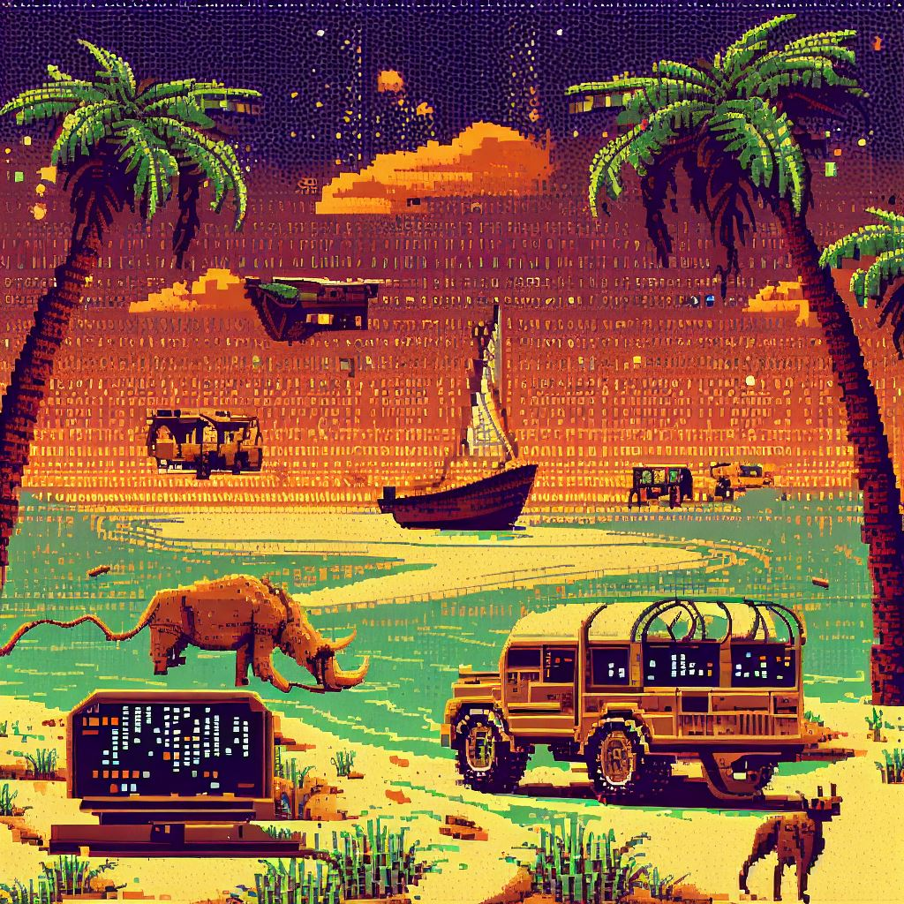

# 🌍 SyntaxSafari 🦒

Venture with me as I embark on the wildest code journey of 2023/24 – exploring 12 vast landscapes of programming languages!



#### _Note: The inspiration comes from the [Exercism 12in23](https://exercism.org/challenges/12in23) challenge. And this is my take on it._

---

## 🚀 **Mission Statement**

*"Why stick to one playground when there are so many to explore?"*

In our daily coding life, we often stick to our comfort zones, using the same old 
languages. But hey, why limit ourselves? Here at `SyntaxSafari`, I'm broadening 
my horizons, and like any true explorer, I'm documenting my journey. Expect bugs, 
laughs, 'aha' moments, and more bugs!

---

## 🎯 **The Targeted Terrains**

1. **[Perl](https://www.perl.org/)** - Diving into the pearls of scripting.
2. **[Go](https://go.dev/)** - Gonna Go where the wind takes me!
3. **[Rust](https://www.rust-lang.org/)** - Making sure my code doesn't corrode.
4. **[C](https://en.wikipedia.org/wiki/C_(programming_language))** - Going back to the roots. C what I did there?
5. **[Bash](https://www.gnu.org/software/bash/)** - Let's make some noise!
6. **[(G)AWK](https://www.gnu.org/software/gawk/manual/gawk.html)** - No, it's not (g)awkward. Or is it?
7. **[Erlang](https://www.erlang.org/)** - Why have one process when you can have many?
8. **[V](https://vlang.io/)** - Aiming for speed, aiming for efficiency!
9. **[Zig](https://ziglang.org/)** - Ziggity zag, let's not let this one lag.
10. **[Haskell](https://www.haskell.org/)** - Asking the functional questions.
11. **[Wren](https://wren.io/)** - Ready to fly with this lightweight scripting bird.  
~~12. **[Java](https://www.java.com/en/)** - Brewing some classic code. Or maybe not. Still deciding.~~
12. **[C++](https://en.wikipedia.org/wiki/C++)** - The final frontier. Taking C to the next level, one plus at a time!

Runners-up:
A short-list of languages that I considered, but didn't make the cut. Maybe next time!

* Java
* JavaScript
* TypeScript
* Python (I already know a thing or two about this one.)

---

## 🗺️ **Current Journey Status**

* [ ] Perl
* [ ] Go
* [ ] Rust
* [ ] C
* [ ] Bash
* [ ] AWK
* [ ] Erlang
* [ ] V
* [ ] Zig
* [ ] Haskell
* [ ] Wren
* [ ] C++

---

## 🧭 **Selecting My Next Safari Destination**

Whenever I feel the call of the wild code, I use the following trusty command to 
randomly pick my next programming language to explore:

```bash
echo "Perl Go Rust C Bash AWK Erlang Zig V Haskell Wren C++" | tr ' ' '\n' | sort | gshuf -n 1
```

This command breaks down our safari landscape into individual terrains, sorts
them for a fair game, and then shuffles to surprise me with my next coding adventure. 
**Where will the winds of `SyntaxSafari` take me next? Let's find out!** 🌪️🦒

_Note: I'm on a macOS, so you need to have `coreutils` installed to use `gshuf`.
If you're on Linux, you can just use `shuf` instead._

```bash
brew install coreutils
```

---

## 📅 **Safari Schedule**

Mark your calendars! The safari officially kicks off on October 1st.
Get ready for an exhilarating journey through the wilds of code!

---

## 📖 **Diary Logs**

Every language comes with its own set of challenges, discoveries, and eureka moments.
Check out my diary logs for each language to get a peek into my adventures and misadventures!

[Link to Diary Logs Directory TO BE ADDED!]

---

## 🤝 **Join the Safari!**

Feel like embarking on a similar journey? Fork this repo, and let's explore together!
Or just hop into the issues and discussions; any and all contributions, suggestions,
and jokes are welcome. The more, the merrier!

---

👩💻 **Happy coding, fellow explorers!** Remember: it's not about mastering every 
terrain, but enjoying the journey and the view.
